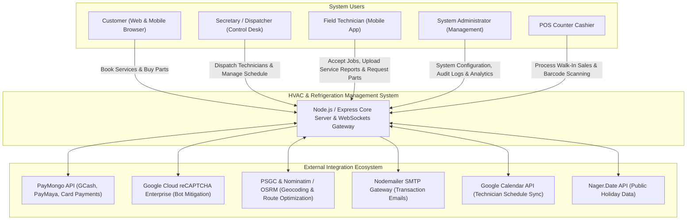
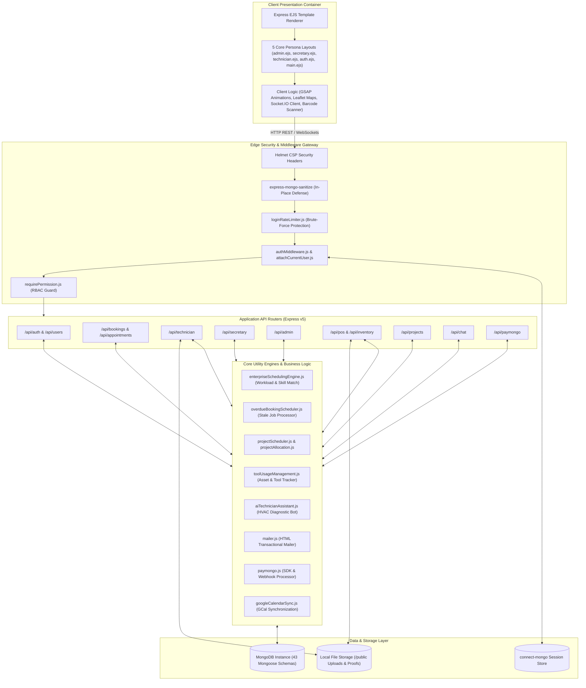
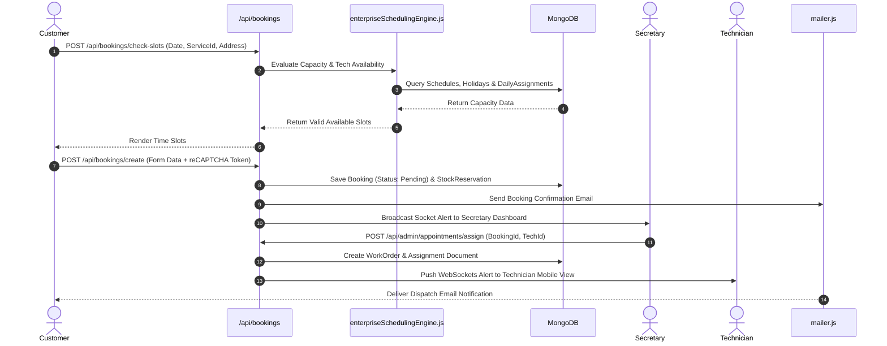
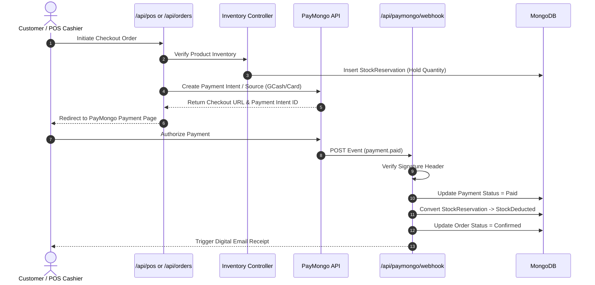
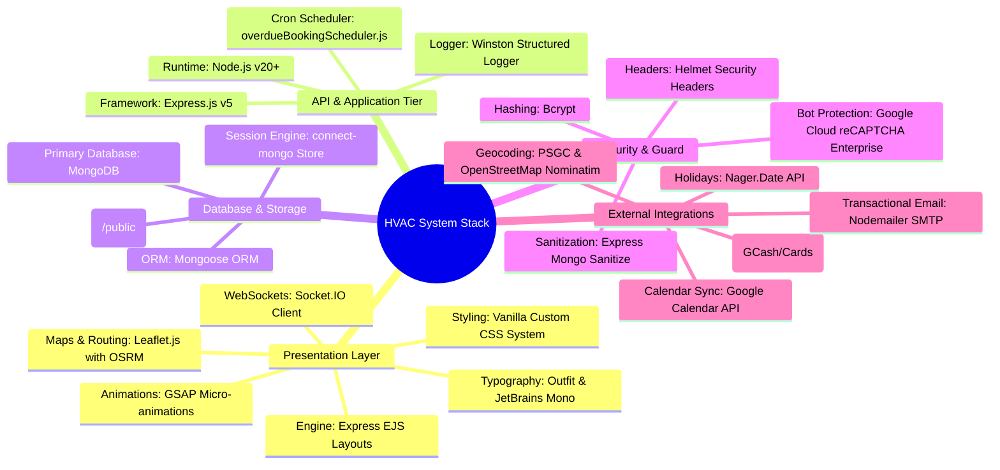

# Enterprise HVAC & Refrigeration Service Management Platform
## Exhaustive Technical System Architecture Specification

> [!IMPORTANT]
> **Source-Audited Architecture Document**: This specification is compiled directly from a comprehensive code analysis of the entire repository codebase, covering all 43 Mongoose data models, 30 Express route modules, 20 custom backend utility engines, 6 security middleware components, 5 EJS view layout targets, and background cron processing modules.

---

## 1. Executive Summary & Architectural Vision

The **Enterprise HVAC & Commercial Refrigeration Service Management Platform** is a unified Enterprise Resource Planning (ERP), Field Service Management (FSM), E-Commerce, Point-of-Sale (POS), and AI-assisted Operations platform tailored specifically for industrial, commercial, and residential HVAC businesses.

### Architectural Principles
- **Role-Gated Multi-Tenant Persona Isolation**: Dedicated UI layouts and REST API namespaces for 4 primary user personas: **Customer**, **Secretary (Dispatcher)**, **Field Technician**, and **System Administrator**.
- **Algorithmic Field Scheduling**: Automated slot availability evaluation, skill matching, technician workload capacity analysis, and non-working day/holiday blocking.
- **Stock Reservation Pattern**: Transactional inventory pattern moving stock through `StockReservation` before permanent deduction upon PayMongo or POS payment confirmation.
- **Real-Time Synchronicity**: Dual Socket.IO websocket broadcasting and Nodemailer SMTP transactional email alerting for field assignment updates, overdue job warnings, and booking status transitions.
- **Deep Security Governance**: Defense-in-depth layout enforcing Content Security Policies, NoSQL payload sanitization, IP/Username brute-force rate limiting, and Google Cloud reCAPTCHA Enterprise bot defense.

---

## 2. C4 System Context & Container Architecture

### 2.1 C4 Level 1: System Context Diagram



---

### 2.2 C4 Level 2: Container & Subsystem Architecture



---

## 3. Subsystem Deep-Dive & Utility Engines

### 3.1 Enterprise Scheduling Engine (`enterpriseSchedulingEngine.js`)
- **Capability**: Evaluates technician slot availability, geographic route optimization, skill qualification matching, and daily workload balancing.
- **Workflow**:
  1. Receives booking parameters: Service Type, Location (PSGC/GPS), Requested Date, and Duration.
  2. Queries `NonWorkingDay` and `importNagerHolidays` to filter out non-operational dates.
  3. Queries `TechnicianSchedule` and `LeaveRequest` to exclude unavailable personnel.
  4. Calculates active workload limits (`DailyAssignment`) to prevent over-scheduling technicians.
  5. Computes travel distance using OSRM/Nominatim geocoding data from `geocodingRoutes.js`.
  6. Returns a validated time-slot availability matrix for front-end rendering.

### 3.2 Overdue Booking & Delay Scheduler (`overdueBookingScheduler.js` & `delayNotifier.js`)
- **Capability**: Background polling mechanism monitoring active appointments and work orders.
- **Workflow**:
  1. Scans `BookingService` documents where status is `In Progress` or `Dispatched` past the scheduled time block.
  2. Automatically flags overdue items and updates `BookingStatus` audit history.
  3. Triggers `delayNotifier.js` to broadcast Socket.IO notifications to dispatchers (`secretaryApi.js`).
  4. Dispatches transactional warning emails to affected customers using `mailer.js`.

### 3.3 Commercial Project Allocation Engine (`projectScheduler.js` & `projectAllocation.js`)
- **Capability**: Manages complex commercial HVAC installations involving multiple phases, material allocation, and sub-contract expenses.
- **Data Models**:
  - `Project.js`: Project metadata, overall budget, milestone status, client details.
  - `ProjectMaterial.js`: Bill of Materials (BOM), allocated inventory items, unit costs.
  - `ProjectIssue.js`: Field issues, delay tickets, safety flags.
  - `Expense.js`: Overhead, labor payroll, sub-contractor costs.

### 3.4 Tool & Equipment Management Subsystem (`toolUsageManagement.js`)
- **Capability**: Tracks high-value HVAC diagnostic tools (vacuum pumps, manifold gauges, leak detectors, recovery machines).
- **Data Models**:
  - `Tool.js`: Tool serial number, condition state (`Available`, `In-Use`, `Maintenance`, `Retired`).
  - `ToolAssignment.js`: Check-out and check-in timestamp logging linked to `Technician`.
  - `ServiceToolUsage.js`: Tool usage duration logged per `WorkOrder`.

### 3.5 AI Diagnostic & Knowledge Assistant (`aiTechnicianAssistant.js`)
- **Capability**: AI assistant aiding field technicians with diagnostic code lookups (error codes like E1, F3, refrigerant pressure charts) and troubleshooting steps.
- **Knowledge Pipeline**: `generateKnowledgeBase.js` parses system service manuals into structured diagnostic vectors utilized by `/api/chat`.

### 3.6 PayMongo Payment & Webhook Engine (`paymongo.js` & `paymongoRoutes.js`)
- **Capability**: Handles GCash, PayMaya, and Credit Card payments via PayMongo REST API.
- **Webhook Handler**: Validates incoming PayMongo signature header (`paymongo-signature`), parses `payment.paid` events, and atomically updates `Payment` and `Order`/`BookingService` statuses.

---

## 4. Comprehensive Data Model Architecture (43 Mongoose Schemas)

```
──────────────────────────────────────────────────────────────────────────────────────────────────
DOMAIN                   MODELS / SCHEMAS                                  PRIMARY RESPONSIBILITY
──────────────────────────────────────────────────────────────────────────────────────────────────
Authentication & Auth    User.js, Role.js, AuthSession.js,                 User credentials, RBAC permissions,
                         LoginHistory.js, FailedLoginAttempt.js            session revocation, security auditing.

Service & Bookings       BookingService.js, BookingStatus.js,               Service catalogue, multi-step appointment
                         Service.js, CoreService.js, RepairService.js,    pipeline, status history, calendar blockers.
                         NonWorkingDay.js

Field Operations &       WorkOrder.js, Assignment.js, DailyAssignment.js,  Field technician dispatch, work orders,
Work Orders              ServiceReport.js, PartsRequest.js, Rating.js      digital service reports, customer ratings.

Tool & Logistics         Tool.js, ToolAssignment.js,                       Tool check-in/out tracking, equipment
                         ServiceToolUsage.js, TechnicianSchedule.js,       durability logs, technician availability.
                         TechnicianAttendance.js, LeaveRequest.js

Inventory & E-Commerce   HVACProduct.js, Category.js, Brand.js,            Product catalogue, warehouse stock levels,
                         Inventory.js, StockAdjustment.js,                 reservations, e-commerce cart, walk-in
                         StockReservation.js, AirconCart.js, Order.js,     POS sales transactions.
                         WalkInSale.js

Commercial Projects      Project.js, ProjectMaterial.js, ProjectIssue.js   Commercial installation projects, material
                                                                           allocation, site issue tracking.

Finance & Operations     Expense.js, Payment.js, SiteSetting.js,          Financial logging, PayMongo transactions,
                         Notification.js, ActivityLog.js                   site configuration, system audit trail.
──────────────────────────────────────────────────────────────────────────────────────────────────
```

---

## 5. End-to-End Data Flow Diagrams

### 5.1 Service Booking & Automated Dispatch Flow



### 5.2 E-Commerce & POS Order Payment Flow



---

## 6. Security, Compliance & Governance Matrix

| Security Layer | Technical Strategy | Primary Code Target |
| :--- | :--- | :--- |
| **HTTP Security Headers** | Hardened Headers via Helmet; removal of `X-Powered-By` and `Server` signature headers; `X-Frame-Options: DENY`, `X-Content-Type-Options: nosniff`. | `server/index.js` |
| **Content Security Policy** | Custom Content Security Policy permitting Leaflet, Carto, OpenStreetMap, reCAPTCHA Enterprise, & Google Maps CDNs while blocking unauthorized sources. | `server/index.js` |
| **NoSQL Injection Defense** | In-place recursive sanitization stripping `$` and `.` characters from `req.body`, `req.query`, `req.params`, and `req.headers`. | `server/index.js` |
| **Brute-Force Rate Limiting** | Rate limiter tracking failed login attempts by IP address and username, enforcing exponential delays and temporary locks. | `server/middleware/loginRateLimiter.js` |
| **RBAC Route Enforcement** | Modular middleware enforcing exact role access (`admin`, `secretary`, `technician`, `customer`) per endpoint namespace. | `server/middleware/requirePermission.js` |
| **Session Revocation** | Server startup dev hooks to clear stale MongoDB session store entries and invalidate active session tokens. | `server/index.js` |
| **Bot Mitigation** | Google Cloud reCAPTCHA Enterprise risk analysis on public forms to prevent automated submission attacks. | `@google-cloud/recaptcha-enterprise` |

---

## 7. Infrastructure, Deployment & Technology Stack



### Production Hosting Topology
- **Application Server Node**: Executed via Node.js v20+ (`npm start` -> `node server/index.js`), deployable on Render (via `render.yaml`), Docker, or PM2 on AWS EC2.
- **Database Topology**: MongoDB Atlas cluster with connection fallback configured to Google Public DNS (`8.8.8.8`).
- **File Upload Storage**: High-payload limits (10MB) configured in Express for handling base64 service report photos, technician proof uploads, and barcode scans.
