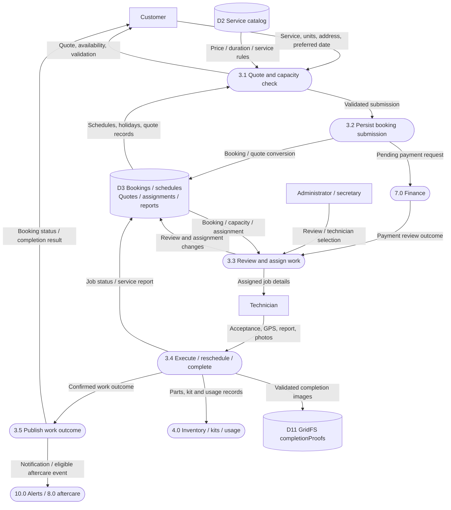
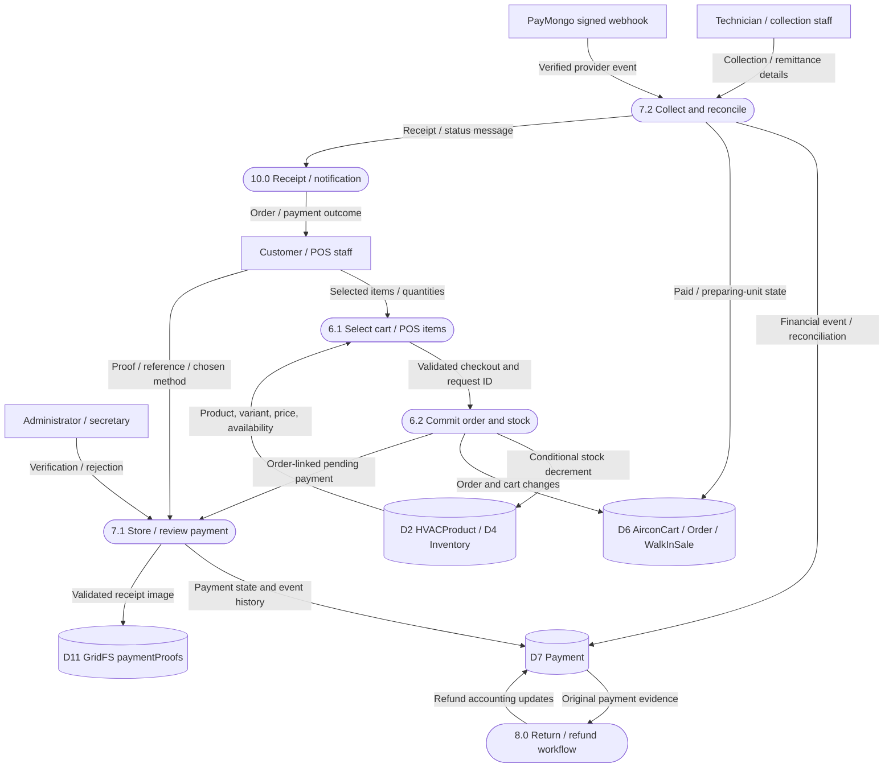
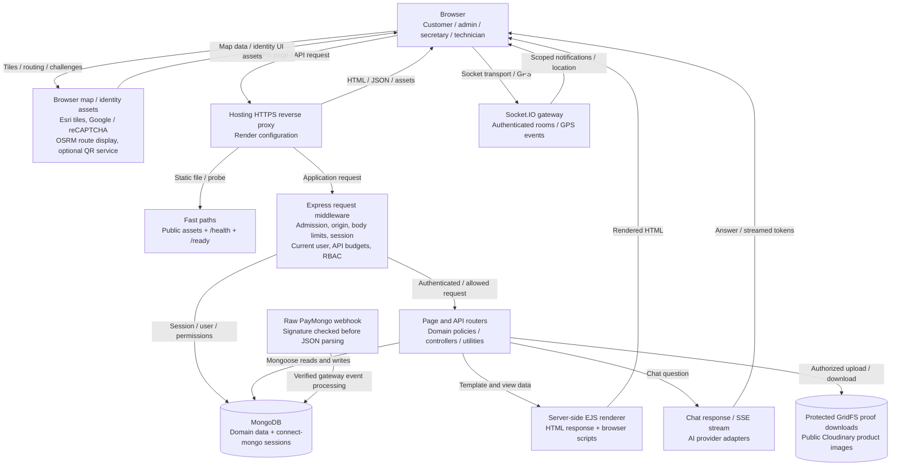
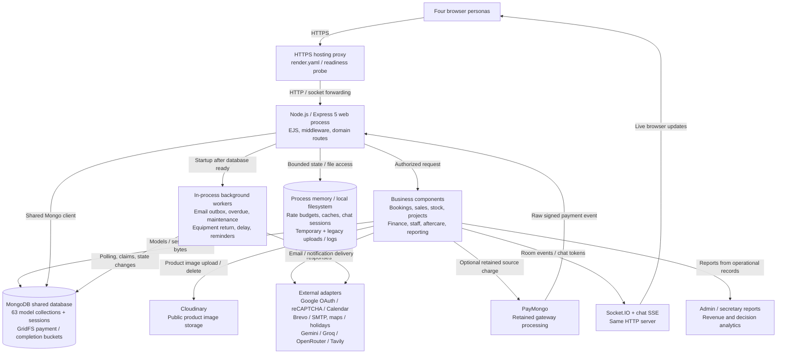

# Data flow and architecture diagrams

Generated with `node scripts/build-architecture-docs.cjs`. SVG files render offline. Mermaid files remain editable. The SVG layouts and Mermaid layouts share nodes and edges; their positions differ.

## DFD — context (Level 0)

The complete application is one process. Actors and external services exchange named data with it; MongoDB is internal and is omitted at this level.

[Download SVG](diagrams/dfd-context.svg) · [Mermaid source](diagrams/dfd-context.mmd)

```mermaid
flowchart TB
  customer["Customer / visitor"]
  admin["Administrator"]
  secretary["Secretary / dispatcher"]
  tech["Technician"]
  p0(["0. CALIDRO RACS<br/>Web management system"])
  identity["Google identity / reCAPTCHA"]
  payment["PayMongo<br/>Retained gateway / webhook"]
  mail["Brevo API / SMTP"]
  geo["Location / calendar providers<br/>PSGC, Geoapify, Nominatim<br/>OSRM, Esri, Google, Nager"]
  ai["Gemini / Groq / OpenRouter<br/>Tavily search"]
  cloud["Cloudinary product images"]
  customer -->|"Account, booking, order, proof, claim"| p0
  p0 -->|"Catalog, quote, receipt, status, answer"| customer
  admin -->|"Approval, pricing, role, settings"| p0
  p0 -->|"Queues, reports, audit, alerts"| admin
  secretary -->|"Dispatch, POS, payment review"| p0
  p0 -->|"Work queues, schedules, reports"| secretary
  tech -->|"Job response, GPS, evidence, attendance"| p0
  p0 -->|"Assignments, kit, payslip, alerts"| tech
  p0 -->|"OAuth / challenge verification"| identity
  identity -->|"Identity / challenge result"| p0
  payment -->|"Signed payment events"| p0
  p0 -->|"Source charge request, if used"| payment
  p0 -->|"Transactional message"| mail
  mail -->|"Delivery response"| p0
  p0 -->|"Address, coordinates, event, holiday query"| geo
  geo -->|"Location, route, event ID, holiday data"| p0
  p0 -->|"Question / conversation / search terms"| ai
  ai -->|"Answer / search evidence"| p0
  p0 -->|"Product image / deletion request"| cloud
  cloud -->|"Image URL / upload result"| p0

```

## DFD — system decomposition (Level 1)

Ten processes and ten logical MongoDB model stores cover all 63 models. D11 and D12 represent additional proof storage and runtime state. Repeated actor boxes are aliases. Provider exchanges balance the context diagram; cross-process contracts and additional store reads are listed in README.md.

[Download SVG](diagrams/dfd-level-1.svg) · [Mermaid source](diagrams/dfd-level-1.mmd)

```mermaid
flowchart TB
  actor0["Customer / staff"]
  p1(["1.0 Identity and access"])
  D1[("D1. Identity and access")]
  actor1["Customer / administrator"]
  p2(["2.0 Catalog and pricing"])
  D2[("D2. Service and product catalog")]
  actor2["Customer / dispatch / technician"]
  p3(["3.0 Booking and dispatch"])
  D3[("D3. Bookings and dispatch")]
  actor3["Administrator / secretary / technician"]
  p4(["4.0 Inventory and field resources"])
  D4[("D4. Stock and field equipment")]
  actor4["Administrator / secretary / technician"]
  p5(["5.0 Project delivery"])
  D5[("D5. Projects and work orders")]
  actor5["Customer / administrator / secretary"]
  p6(["6.0 Sales and fulfillment"])
  D6[("D6. Sales and carts")]
  actor6["Customer / staff"]
  p7(["7.0 Finance and payroll"])
  D7[("D7. Finance and compensation")]
  actor7["Customer / staff"]
  p8(["8.0 Aftercare and feedback"])
  D8[("D8. Aftercare and feedback")]
  actor8["Technician / secretary / administrator"]
  p9(["9.0 Attendance and leave"])
  D9[("D9. Attendance and leave")]
  actor9["Customer / staff"]
  p10(["10.0 Reports, settings and assistance"])
  D10[("D10. Configuration and communication")]
  identity1["Google OAuth / reCAPTCHA"]
  cloud1["Cloudinary"]
  geo1["Maps / addresses / calendars<br/>PSGC, Geoapify, Nominatim, OSRM<br/>Esri, Google, Nager.Date"]
  gateway1["PayMongo retained gateway"]
  ai1["Gemini / Groq / OpenRouter<br/>Tavily search"]
  mail1["Brevo API / SMTP"]
  d11[("D11 GridFS proofs<br/>paymentProofs / completionProofs")]
  d12[("D12 Runtime / local storage<br/>Chat history, caches, temp uploads<br/>Legacy files, logs")]
  actor0 -->|"Credentials, OTP, OAuth response"| p1
  p1 -->|"Access result, profile, session"| actor0
  D1 -->|"Stored records"| p1
  p1 -->|"New / changed records"| D1
  actor1 -->|"Catalog query, catalog changes"| p2
  p2 -->|"Service / product details, prices"| actor1
  D2 -->|"Stored records"| p2
  p2 -->|"New / changed records"| D2
  actor2 -->|"Booking, quote choice, job response"| p3
  p3 -->|"Availability, quote, assignment, status"| actor2
  D3 -->|"Stored records"| p3
  p3 -->|"New / changed records"| D3
  actor3 -->|"Stock entry, kit, usage, return"| p4
  p4 -->|"Stock, reservations, equipment ledger"| actor3
  D4 -->|"Stored records"| p4
  p4 -->|"New / changed records"| D4
  actor4 -->|"Project plan, materials, work report"| p5
  p5 -->|"Work orders, resource plan, progress"| actor4
  D5 -->|"Stored records"| p5
  p5 -->|"New / changed records"| D5
  actor5 -->|"Cart, checkout, POS, delivery update"| p6
  p6 -->|"Order, receipt, fulfillment status"| actor5
  D6 -->|"Stored records"| p6
  p6 -->|"New / changed records"| D6
  actor6 -->|"Proof, payment review, remittance"| p7
  p7 -->|"Payment result, refund, payroll result"| actor6
  D7 -->|"Stored records"| p7
  p7 -->|"New / changed records"| D7
  actor7 -->|"Asset, maintenance, warranty, return, rating"| p8
  p8 -->|"Coverage, follow-up, claim / return result"| actor7
  D8 -->|"Stored records"| p8
  p8 -->|"New / changed records"| D8
  actor8 -->|"Attendance, leave, approval"| p9
  p9 -->|"Attendance / leave result"| actor8
  D9 -->|"Stored records"| p9
  p9 -->|"New / changed records"| D9
  actor9 -->|"Report query, settings, chat question"| p10
  p10 -->|"Report, settings result, AI answer, alerts"| actor9
  D10 -->|"Stored records"| p10
  p10 -->|"New / changed records"| D10
  p1 -->|"OAuth / challenge request"| identity1
  identity1 -->|"Identity / verification result"| p1
  p2 -->|"Product image / deletion"| cloud1
  cloud1 -->|"Image URL / upload result"| p2
  p3 -->|"Address / route / event query"| geo1
  geo1 -->|"Location / route / calendar data"| p3
  p7 -->|"Optional source charge"| gateway1
  gateway1 -->|"Signed payment event"| p7
  p10 -->|"Question / search terms"| ai1
  ai1 -->|"Answer / search result"| p10
  p10 -->|"Transactional email"| mail1
  mail1 -->|"Delivery result"| p10
  p3 -->|"Completion images"| d11
  d11 -->|"Authorized completion evidence"| p3
  p7 -->|"Payment proof images"| d11
  d11 -->|"Authorized payment evidence"| p7
  p10 -->|"Chat / cache state and logs"| d12
  d12 -->|"Cached data / chat context"| p10

```

## DFD — booking and field service (Level 2 of 3.0)

Decomposes booking submission, review, dispatch and execution. Payment confirmation is an input from 7.0; resource usage belongs to 4.0. Repair quotations and custom-unit / relocation requests use the same booking domain.

[Download SVG](diagrams/dfd-booking-level-2.svg) · [Mermaid source](diagrams/dfd-booking-level-2.mmd)

## DFD — sales and payment (Level 2 of 6.0 / 7.0)

Product checkout decrements Inventory or HVACProduct variant stock conditionally. Tool StockReservation records belong to field resources. Online card checkout is retired; signed gateway events remain handled by the code.

[Download SVG](diagrams/dfd-sales-level-2.svg) · [Mermaid source](diagrams/dfd-sales-level-2.mmd)

## Web architecture — request and response path

EJS executes on the server. The browser receives HTML, CSS and JavaScript, then uses JSON APIs, SSE chat and Socket.IO. All backend components share one Node.js process.

[Download SVG](diagrams/web-architecture.svg) · [Mermaid source](diagrams/web-architecture.mmd)

## System architecture — deployed containers and components

Observed deployment: one Node web service plus MongoDB and external providers. Timers, caches, web sockets and domain modules are components of that service, rather than independently deployed services.

[Download SVG](diagrams/system-architecture.svg) · [Mermaid source](diagrams/system-architecture.mmd)

## All model references

Static references only; arrows point from a referencing model to its target. Cardinalities and foreign-key enforcement are not implied. Dynamic refPath relationships are detailed in MODEL_AUDIT.md.

[Full model graph](diagrams/model-references.mmd)

```mermaid
flowchart LR
  ActivityLog["ActivityLog"]
  AirconCart["AirconCart"]
  Assignment["Assignment"]
  AuthSession["AuthSession"]
  BookingService["BookingService"]
  Brand["Brand"]
  Category["Category"]
  CoreService["CoreService"]
  CustomerAsset["CustomerAsset"]
  DailyAssignment["DailyAssignment"]
  DailyKit["DailyKit"]
  EmailDeliveryLog["EmailDeliveryLog"]
  EmailOutbox["EmailOutbox"]
  EmployeeCompensation["EmployeeCompensation"]
  EquipmentAssignment["EquipmentAssignment"]
  EquipmentUsageLog["EquipmentUsageLog"]
  Expense["Expense"]
  FailedLoginAttempt["FailedLoginAttempt"]
  HVACProduct["HVACProduct"]
  Inventory["Inventory"]
  LeaveRequest["LeaveRequest"]
  LoginHistory["LoginHistory"]
  MaintenanceSchedule["MaintenanceSchedule"]
  NonWorkingDay["NonWorkingDay"]
  Notification["Notification"]
  OperationLock["OperationLock"]
  Order["Order"]
  PartsRequest["PartsRequest"]
  Payment["Payment"]
  Payroll["Payroll"]
  ProductRefund["ProductRefund"]
  ProductReturn["ProductReturn"]
  ProductReturnMovement["ProductReturnMovement"]
  Project["Project"]
  ProjectIssue["ProjectIssue"]
  ProjectMaterial["ProjectMaterial"]
  ProjectResourcePurchase["ProjectResourcePurchase"]
  ProjectWorkSubmission["ProjectWorkSubmission"]
  Purchase["Purchase"]
  Rating["Rating"]
  RelocationRequest["RelocationRequest"]
  RepairService["RepairService"]
  Role["Role"]
  Secretary["Secretary"]
  SecretaryAttendance["SecretaryAttendance"]
  Service["Service"]
  ServiceCategory["ServiceCategory"]
  ServiceReport["ServiceReport"]
  ServiceToolUsage["ServiceToolUsage"]
  SiteSetting["SiteSetting"]
  StockAdjustment["StockAdjustment"]
  StockReservation["StockReservation"]
  Technician["Technician"]
  TechnicianAttendance["TechnicianAttendance"]
  TechnicianSchedule["TechnicianSchedule"]
  Tool["Tool"]
  ToolAssignment["ToolAssignment"]
  TrustedDevice["TrustedDevice"]
  UnitAssistanceRequest["UnitAssistanceRequest"]
  User["User"]
  WalkInSale["WalkInSale"]
  WarrantyClaim["WarrantyClaim"]
  WorkOrder["WorkOrder"]
  ActivityLog --> User
  AirconCart --> User
  AirconCart --> Inventory
  Assignment --> BookingService
  Assignment --> Project
  Assignment --> Technician
  Assignment --> User
  AuthSession --> User
  BookingService --> User
  BookingService --> Technician
  BookingService --> Order
  BookingService --> UnitAssistanceRequest
  BookingService --> RelocationRequest
  BookingService --> CustomerAsset
  BookingService --> Assignment
  BookingService --> Tool
  BookingService --> ServiceReport
  BookingService --> MaintenanceSchedule
  BookingService --> BookingService
  CoreService --> User
  CustomerAsset --> User
  CustomerAsset --> MaintenanceSchedule
  CustomerAsset --> BookingService
  DailyAssignment --> Project
  DailyAssignment --> WorkOrder
  DailyAssignment --> Technician
  DailyKit --> Technician
  DailyKit --> Tool
  DailyKit --> User
  DailyKit --> EquipmentAssignment
  DailyKit --> Order
  DailyKit --> Project
  DailyKit --> WorkOrder
  DailyKit --> DailyAssignment
  EmployeeCompensation --> User
  EquipmentAssignment --> Project
  EquipmentAssignment --> BookingService
  EquipmentAssignment --> DailyKit
  EquipmentAssignment --> Technician
  EquipmentAssignment --> WorkOrder
  EquipmentAssignment --> Tool
  EquipmentAssignment --> User
  EquipmentUsageLog --> Technician
  EquipmentUsageLog --> Tool
  EquipmentUsageLog --> User
  Expense --> Technician
  Expense --> BookingService
  Expense --> Project
  Expense --> WorkOrder
  Expense --> User
  FailedLoginAttempt --> User
  HVACProduct --> Brand
  HVACProduct --> Category
  HVACProduct --> User
  Inventory --> Brand
  Inventory --> Category
  Inventory --> User
  LeaveRequest --> Technician
  LeaveRequest --> User
  LoginHistory --> User
  MaintenanceSchedule --> CustomerAsset
  MaintenanceSchedule --> User
  MaintenanceSchedule --> BookingService
  NonWorkingDay --> Service
  NonWorkingDay --> User
  Notification --> User
  Order --> User
  Order --> Inventory
  Order --> Technician
  Order --> BookingService
  Order --> DailyKit
  Order --> Payment
  PartsRequest --> Project
  PartsRequest --> BookingService
  PartsRequest --> User
  PartsRequest --> Technician
  PartsRequest --> Tool
  Payment --> BookingService
  Payment --> Order
  Payment --> Project
  Payment --> WorkOrder
  Payment --> Technician
  Payment --> User
  Payment --> Payroll
  Payroll --> User
  Payroll --> EmployeeCompensation
  ProductRefund --> ProductReturn
  ProductRefund --> Payment
  ProductRefund --> User
  ProductReturn --> User
  ProductReturn --> BookingService
  ProductReturn --> WorkOrder
  ProductReturn --> ProductRefund
  ProductReturnMovement --> ProductReturn
  ProductReturnMovement --> User
  Project --> BookingService
  Project --> User
  Project --> Technician
  Project --> Tool
  Project --> WorkOrder
  Project --> PartsRequest
  Project --> ProjectResourcePurchase
  Project --> Assignment
  ProjectIssue --> Project
  ProjectIssue --> WorkOrder
  ProjectIssue --> Technician
  ProjectIssue --> User
  ProjectMaterial --> Project
  ProjectMaterial --> WorkOrder
  ProjectMaterial --> Technician
  ProjectMaterial --> User
  ProjectResourcePurchase --> Project
  ProjectResourcePurchase --> Tool
  ProjectResourcePurchase --> User
  ProjectResourcePurchase --> StockAdjustment
  ProjectWorkSubmission --> Project
  ProjectWorkSubmission --> Technician
  ProjectWorkSubmission --> User
  ProjectWorkSubmission --> WorkOrder
  ProjectWorkSubmission --> EquipmentAssignment
  ProjectWorkSubmission --> Tool
  Purchase --> User
  Rating --> User
  RelocationRequest --> User
  RelocationRequest --> CoreService
  RelocationRequest --> CustomerAsset
  RelocationRequest --> BookingService
  Secretary --> User
  SecretaryAttendance --> User
  ServiceCategory --> User
  ServiceReport --> BookingService
  ServiceReport --> Assignment
  ServiceReport --> Technician
  ServiceReport --> User
  ServiceToolUsage --> BookingService
  ServiceToolUsage --> Order
  ServiceToolUsage --> Assignment
  ServiceToolUsage --> Project
  ServiceToolUsage --> WorkOrder
  ServiceToolUsage --> DailyAssignment
  ServiceToolUsage --> Technician
  ServiceToolUsage --> Tool
  ServiceToolUsage --> User
  StockAdjustment --> Tool
  StockAdjustment --> BookingService
  StockAdjustment --> User
  StockReservation --> Tool
  StockReservation --> BookingService
  Technician --> User
  TechnicianAttendance --> Technician
  TechnicianAttendance --> User
  TechnicianSchedule --> Technician
  Tool --> User
  ToolAssignment --> Tool
  ToolAssignment --> Technician
  ToolAssignment --> User
  TrustedDevice --> User
  UnitAssistanceRequest --> User
  UnitAssistanceRequest --> CoreService
  UnitAssistanceRequest --> BookingService
  UnitAssistanceRequest --> CustomerAsset
  User --> User
  WalkInSale --> Tool
  WalkInSale --> HVACProduct
  WalkInSale --> User
  WarrantyClaim --> User
  WarrantyClaim --> Technician
  WorkOrder --> Project
  WorkOrder --> BookingService
  WorkOrder --> Technician
  WorkOrder --> Tool
  WorkOrder --> User
  MissingProduct["Product: unregistered target"]
  Purchase -.-> MissingProduct
  classDef missing fill:#fff1f2,stroke:#be123c;
  class MissingProduct missing;

```

