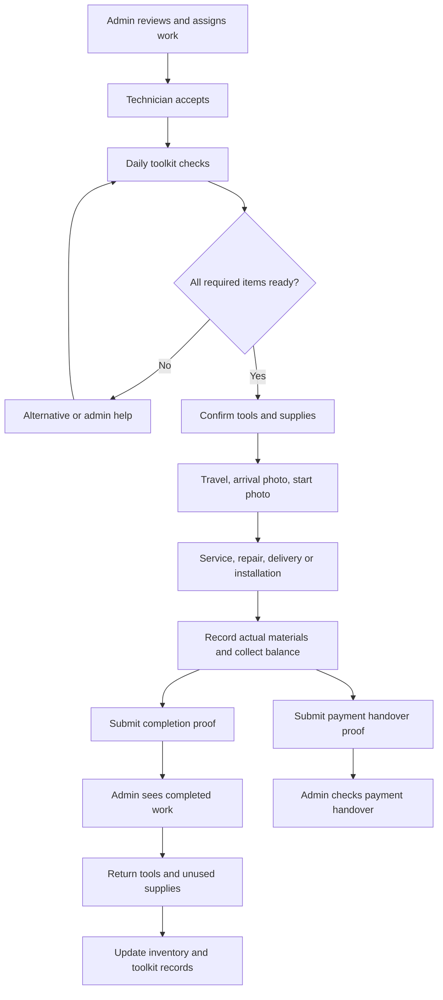

# Technician and admin service/order audit

Audit date: October 9, 2026. Reviewed the current working tree, including existing local changes.

The technician toolkit **is connected to the admin**, but several steps can fail or leave wrong records. The current process should not be treated as fully working.

This was an audit only. No application files, database records, live jobs, stock, or payments were changed for this audit. Added this report and a local diagnostic script.

## What was checked

| Process | Technician step | Admin connection | Result |
| --- | --- | --- | --- |
| Standard service booking | Accept, prepare tools, travel, arrive, start, collect payment, send completion photo | Assignment and booking records; appointments, active/completed work, reports | Connected. Alternate completion paths can skip required evidence. |
| Repair booking | Accept inspection, prepare tools, inspect, submit findings/parts, quote, schedule repair, collect payment, finish | Repair queue, parts requests, quotations, repair scheduling, payments | Connected. One repair status route can finish unpaid work without completion proof. |
| Mixed booking | Standard services and repair items share a visit but have separate item states | Same booking, assignment, service-item histories | Connected. Item/batch completion does not use the shared proof and material-usage checks. |
| Delivery only order | Accept, deliver, arrive, collect remaining balance, finish | Admin orders and dispatch preparation | Connected. Technician transitions, arrival/completion proof and final-balance checks are present. |
| Delivery and installation order | Accept, confirm daily kit, depart, arrive, install, record serial numbers and materials, finish | Admin orders, dispatch readiness, linked installation booking, stock and service history | Connected. Extra toolkit items and failed completion retries are not handled safely. |
| Large project | Team acceptance, confirmed daily schedule, daily kit, travel/arrival/start, work proof, materials, payment, finish | Project team, work orders, daily assignments, work submissions, payments | The central flow has ownership checks and grouped database writes for submissions/payments/completion. Shared toolkit defects still affect it; see additional code findings. |
| Missing tools | Choose an alternative, mark not needed, ask admin | Daily kit issues on dashboard, inventory, admin tool view, saved notifications | Single-item notification fails. Extra-item issues and replacement tools can get lost. |
| Returns | Return tools or unused supplies | Equipment records, daily kit, inventory counters, overdue return view | Multiple return paths disagree; repeated returns can add stock twice. |
| Cash/payment handover | Record collection, upload handover proof, submit to admin | Payment record, remittance review, linked booking/order/project payment status | Connected. Service collection can create duplicate payments on simultaneous submission. |
| Cancellation/no-show/reschedule | Decline/cancel, report unavailable customer, request a new date | Assignment history, no-show review and resolution center | Dedicated routes exist. The toolkit dashboard's “Reschedule Job” action does not use those scheduling routes. |

The main shared records are `Assignment`, `BookingService`, `Order`, `DailyKit`, `EquipmentAssignment`, `Tool`, `StockReservation`, `ServiceToolUsage`, and `Payment`. Projects add `Project`, `WorkOrder`, `DailyAssignment`, and `ProjectWorkSubmission`.

This diagram shows the intended steps. It does not mean every route currently enforces them.

## Reproduced problems

Priority 1 means wrong stock/payment records or a required work step can be skipped. Priority 2 means a broken action, missing issue, or stale display.

The diagnostic script executed the current route handlers and helpers with in-memory model doubles. These are isolated reproductions, not browser tests or live database tests. Where appropriate, external helpers were replaced with fixed responses. The script's successful exit means the listed problems were reproduced; it does **not** mean the application passed.

### A11 — Priority 1: service payment can be recorded twice

Source: [technicianApi.js](../../server/routes/technicianApi.js#L5063).

Two requests can read the same unpaid booking and both create a final payment before either saves the updated balance. The reproduction recorded two PHP 1,000 payments for one PHP 1,000 balance; both returned HTTP 201. There is no shared transaction or conditional claim of the balance in this route.

Fix direction: claim the outstanding balance and create the payment together. A repeated request must return the existing payment or a clear conflict. Verify with two simultaneous submissions and a retry after an interrupted response.

### A03 — Priority 1: failed toolkit confirmation can deduct stock again on retry

Source: [dailyKitService.js](../../server/utils/dailyKitService.js#L643), particularly the item loop at line 692.

Each item is deducted and logged separately; the kit is saved only after the loop. If a later item becomes unavailable, earlier deductions remain. In the reproduction, the first material started with 5 units and ended with 3 after two failed confirmation attempts, while the kit had never been confirmed.

Fix direction: confirm the kit, deduct stock, and create equipment records in one transaction, with safe repeat submission handling. Validate available stock after existing holds, not only the on-hand quantity. Check simultaneous confirmations too.

### A02 — Priority 1: repeating a daily equipment return adds stock twice

Source: [technicianApi.js](../../server/routes/technicianApi.js#L10375).

`POST /daily-kit/return` adds the kit item quantity to inventory even when no active equipment assignments remain. Returning one issued tool twice produced 2 available units; the second request still returned HTTP 200. A standard/personal alternative row can also reach the stock-increase code without a matching company checkout.

Fix direction: restore only the quantity from equipment records successfully claimed for return. Save inventory, equipment and kit state together. A repeat must not increase stock.

### A08 — Priority 1: a repair status route skips payment and completion proof

Source: [technicianApi.js](../../server/routes/technicianApi.js#L11143).

`POST /repairs/:bookingId/status` allows `in_progress -> completed`, then marks the booking `repair_completed`. The reproduction returned HTTP 200 and completed both records with PHP 1,000 still unpaid and no completion photo. This differs from the checks in the dedicated `complete-repair` route.

Fix direction: route repair completion through one checked completion operation. Reject the generic completion request unless proof, payment and required repair work are all recorded. Mixed bookings must keep unfinished standard-service items open.

### A07 — Priority 1: standard-service item/batch completion skips proof and actual materials

Sources: [technicianApi.js](../../server/routes/technicianApi.js#L417) and the item-status route at line 559; buttons are wired in [assignments.ejs](../../server/views/pages/technician/assignments.ejs#L7548).

The batch route finished the booking and assignment with no completion photo and no submitted material usage. The single-item route has the same gap when the final item finishes. The normal proof-of-completion route requires these checks, so the rules differ depending on which button or endpoint is used. The reproduction used the real service-item transition helper.

Fix direction: item completion may record progress, but final booking completion must use the shared evidence, payment, relocation checklist and actual-usage checks.

### A04 — Priority 1: installation orders can depart before extra toolkit items are confirmed

Source: [orderPreparation.js](../../server/utils/orderPreparation.js#L62), used by [orderRoutes.js](../../server/routes/orderRoutes.js#L1663).

Order readiness checks whether added items have a resolution label, but does not require `kit.hasDelta` to be cleared. A confirmed kit with an extra pending material marked `assigned_from_stock` passed departure readiness even though the extra material had not been issued. A kit awaiting review for a new job but having no extra physical items also passed. Service booking departure correctly blocks these cases.

Fix direction: apply the same additional-preparation confirmation rule to bookings, orders and projects. Resolving a missing item must not count as physically issuing it.

### A09 — Priority 1: order completion retries can record materials twice

Sources: [dailyKitService.js](../../server/utils/dailyKitService.js#L864) and [orderRoutes.js](../../server/routes/orderRoutes.js#L1707).

Order material usage is saved before the order completion save, outside a shared transaction. If later work fails, the order may remain unfinished while usage is already recorded. Repeating the same usage calls created two usage rows and counted the same unit twice. When remaining supplies are exhausted, a retry can instead become blocked. The booking proof route already groups its completion and usage writes.

The order route also only records usage when the caller supplies an array; missing usage is not rejected by that condition.

Fix direction: save order completion, usage and linked booking state together. Give the completion a stable request identity and require an explicit actual-usage decision for each covered material.

### A01 — Priority 2: single-item “Notify Admin” always fails

Sources: [technicianApi.js](../../server/routes/technicianApi.js#L10903) and [technician-order-daily-kit.ejs](../../server/views/partials/technician-order-daily-kit.ejs#L181).

The handler reads `eqAssignments.length`, but `eqAssignments` does not exist in that handler. The reproduction returned HTTP 500 before the kit was saved or the notification was created. The shared booking/order toolkit button calls this endpoint.

Fix direction: remove the unrelated equipment-return check and verify that both original and extra items are reported. Link the notice to the correct inventory/tool page and preserve the selected work date and category.

### A05 — Priority 2: admin cannot resolve issues for extra toolkit items

Sources: [adminApi.js](../../server/routes/adminApi.js#L9683) and the resolve endpoint at line 9773.

The dashboard issue query and loop only use `kit.items`; the resolve endpoint also only searches that array. Missing items in `kit.deltaItems`, added after the original kit was confirmed, are omitted and cannot be resolved by that endpoint. The diagnostic captured the current filter, which does not include `deltaItems`.

Order/project source links are also not included in this dashboard issue payload; it only loads service bookings. The separate admin tools page does display extra rows, but that does not repair the dashboard action.

Fix direction: use one item identity for regular and added rows. Show each affected booking, order and project, and resolve the exact selected item.

### A06 — Priority 2: toolkit “Reschedule Job” reports success without rescheduling

Sources: [adminApi.js](../../server/routes/adminApi.js#L9773) and [admin-dashboard.ejs](../../server/views/pages/admin/admin-dashboard.ejs#L1533).

The action saves only `item.resolution.status = rescheduled`. It accepts no new date/time and does not update the booking, order, assignment or project schedule. The reproduction returned success with zero booking-date writes. Checklist helpers exempt items marked rescheduled, so the action can also hide an unresolved preparation need.

Fix direction: open the existing scheduling flow for the affected job and mark the issue resolved only after an actual schedule change succeeds.

### A10 — Priority 2: the Tools return path leaves the toolkit stale

Sources: [technicianApi.js](../../server/routes/technicianApi.js#L11437) and [tools.ejs](../../server/views/pages/technician/tools.ejs#L292).

The technician Tools page can return an `EquipmentAssignment` linked to a daily kit. Its return handler updates inventory and the equipment record, but not the kit item. The reproduction returned HTTP 200 with the equipment record marked returned and no daily-kit update. The kit can still show checked-out equipment. This also allows shared equipment to be returned while other jobs still need it.

Fix direction: use one return operation from technician Tools, daily preparation, projects and admin. Update every linked record and prevent early return while covered work is still open.

### A12 — Priority 2: a refresh can lose an admin-assigned replacement tool

Sources: [adminApi.js](../../server/routes/adminApi.js#L9803), [dailyKitService.js](../../server/utils/dailyKitService.js#L492), and [servicePreparation.js](../../server/utils/servicePreparation.js#L65).

Admin changes the row's tool ID, but draft refresh preserves resolution by the tool ID generated from catalog matching. If catalog matching selects the original item again, its key differs from the replacement's key and the admin decision is dropped. The reproduction supplied that catalog result and observed the original unavailable tool replacing the resolved row. Catalog preference only helps when the replacement survives matching and scores well enough; it is not an explicit override.

Fix direction: save the selected replacement against a stable requirement identity, and use it before automatic matching. Rechecking the kit must keep the admin decision.

### A13 — Priority 2: live toolkit updates use the wrong socket room

Sources: [adminApi.js](../../server/routes/adminApi.js#L9843) and [index.js](../../server/index.js#L872).

Admin emits `daily_kit:updated` to `tech:<user ID>`. The socket server joins technicians to `tech:<Technician record ID>` and prevents joining arbitrary technician rooms. The reproduction captured different rooms. Saved user notifications may still arrive through the separate user room, but this toolkit event misses its intended recipient.

Fix direction: use the Technician record ID consistently and subscribe the shared toolkit on both services and orders.

## Additional code findings

These were found by source review and were not included in the 13 isolated reproductions above.

| Finding | Evidence | Effect and follow-up |
| --- | --- | --- |
| Standard job accept/decline can update an unrelated project's team state | `technicianApi.js:3343` and `:4178` find a project only by technician membership, without matching the current assignment's project/booking | A technician on several projects can change the wrong project's acceptance state by responding to a standard job. Limit the update to the assignment's own project. |
| Some booking updates use a socket room staff never join | `technicianApi.js:687`, `:9523` emit to `admin`; `index.js:871` joins staff to `admin-room` | A saved update may not refresh an open admin page. Use one staff-room name. Verify actual delivery with both admin and secretary sessions. |
| Admin tools view omits project job context | `appointmentManagement.js:2437` builds the job list only from `bookingIds` and `orderIds` | A project-only kit can show zero jobs despite covered daily project work. Add project/work-order/daily-assignment links and verify counts. |
| Admin replacement search and resolution do not validate all stock rules | `adminApi.js:9742` searches `type: equipment` and on-hand quantity, without the inventory-class/assignable/free-stock checks; `:9803` accepts a replacement ID without loading the tool | Tool-class stock may be missed, while held or damaged stock can be offered. Validate the correct equipment/consumable/part category, usable condition and unreserved quantity. A claimed replacement must stay usable on refresh and confirmation. |

## Checks and limits

- First focused run: **121 passed, 0 failed**, covering technician flow, preparation, daily kits, orders, projects, roles, notifications and responsive markup.
- Complete existing suite: **1,183 checks; 1,171 passed, 12 failed**. These failures are listed below; the suite is not clean.
- Diagnostic run: **13 problems reproduced** using current code with in-memory model doubles. Result: [technician-admin-audit-evidence.json](technician-admin-audit-evidence.json).
- Run diagnostics with `node scripts/audit-technician-admin.cjs`. It performs no live writes. It is an audit tool, not a replacement for acceptance tests after fixes.
- No signed-in technician/admin browser session, real database transaction, real image upload, or live socket round trip was exercised. Those checks are still required after fixes. No claim is made that a passing source/markup check proves an entire user journey works.

The 12 existing failures were:

| Test file | Failing check |
| --- | --- |
| `admin-sidebar-navigation.test.js` | Sidebar navigation hierarchy |
| `booking-history-regression.test.js` | Booking-history row actions |
| `booking-history-regression.test.js` | Repair edit form focus |
| `chat-intent.test.js` | Whole-phrase request detection |
| `customer-booking-workflow.test.js` | Schedule action across booking states |
| `customer-slot-validity.test.js` | Stale date/time selection clearing |
| `operations-list-policy.test.js` | Deferred evidence endpoint boundaries/source assertions |
| `payment-option-presentation.test.js` | Aircon checkout total/presentation assertions |
| `relocation-workflow.test.js` | Custom quote's location/date submission |
| `shared-dashboard-rbac.test.js` | Secretary navigation structure |
| `travel-fare-consistency.test.js` | Road-distance quote fixture and fare consistency |
| `walk-in-aircon.test.js` | POS aircon tab/source assertions |

Several failures inspect literal source text and may need updates for earlier changes. The travel quote fixture omits the route geometry now required by the delivery quote helper. Their presence is recorded here; they have not all been treated as confirmed user-facing defects or silently changed to make the suite pass.

## Suggested fix order and final verification

1. Protect stock and payment writes from partial failure and repeated submission: A11, A03, A02 and A09.
2. Use shared departure and final-completion checks across all routes: A04, A07 and A08.
3. Repair missing-item reporting, stable replacements, actual rescheduling and live updates: A01, A05, A06, A12 and A13.
4. Make all return paths update the same records and preserve remaining jobs: A10.
5. Correct project context/counts and review the 12 existing failed checks.

After implementation, use isolated test accounts and stock to complete these journeys in the browser:

| Journey | Required verification |
| --- | --- |
| Cleaning booking | Admin assigns; technician accepts, checks kit, travels, arrives, starts, records actual materials, collects exact balance, uploads completion photo; admin sees the same final state. |
| Repair booking | Inspect, submit findings/parts, admin reviews quote, customer accepts, schedule Phase 2, confirm parts, repair, collect payment and finish with proof; unfinished mixed-service items stay open. |
| Delivery only | Admin marks dispatch ready; technician accepts and delivers; arrival/completion photos and payment rules hold; no installation kit is required. |
| Delivery and installation | Admin confirms dispatch; kit covers the order once; technician installs, records serials and usage, collects balance and finishes; the linked booking matches the order. |
| Project | Each crew member sees only assigned work; confirmed daily plans feed the kit; proof-backed work/material submissions update admin progress; required payment/work submission checks hold before project closeout. |
| Missing item after confirmation | Add a late job, report its added missing item, resolve as admin, refresh, check/confirm additions, then depart. The issue, source job and replacement must remain visible until complete. |
| Failure and retry | Interrupt confirmation, payment collection, completion and return; repeat each request and send two simultaneous requests. No stock, material use or payment is recorded twice. |
| End-of-day returns | Return reusable tools and unused supplies once; all admin/technician views agree; damaged/lost items cannot be offered for the next job. |
