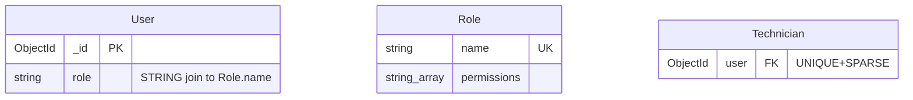
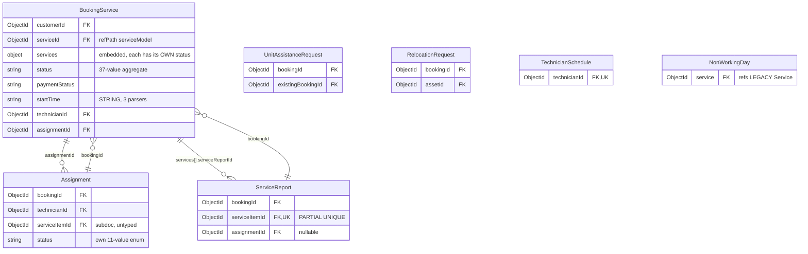
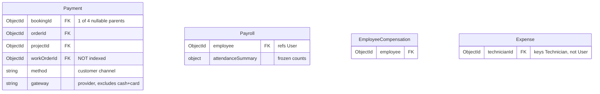

# CALIDRO RACS — Entity Relationship Diagram

**New complete draw.io ERD:** [Open the preview](drawio/index.html) or [download the editable draw.io file](drawio/racs-system-erd.drawio). This version reads every schema reference and includes all fields and storage collections. See [the draw.io guide](drawio/README.md) for current coverage and how to open it.

> ### Open the visual ERD: **[`index.html`](index.html)**
> One self-contained page with a tab per bounded context, a searchable relationship
> register and an entity register. Mermaid renders from a CDN; if you're offline the
> page falls back to showing the Mermaid source instead of breaking.

**Scope:** all 63 registered Mongoose models, 228 declared relationships, one MongoDB database.
**Generated by:** `node scripts/erd/build.js` (reads the live schemas; no DB connection, no `.env`).
**Companion files:** [`index.html`](index.html) (visual viewer), [`erd-inventory.json`](erd-inventory.json) (machine-readable), [`diagrams/`](diagrams) (Mermaid sources).

---

## 1. How to read this document

The ERD is **generated, not hand-drawn**. `scripts/erd/build.js` loads every compiled Mongoose schema and
derives the real structure. A hand-authored layer (`scripts/erd/meta.*.js`) adds only the things a schema
cannot tell you: what an entity is *for*, what a relationship *means*, and where the model is dangerous.
The builder then **cross-checks the two and exits non-zero if they disagree**. If someone renames a field,
drops a `ref`, or adds a dangling reference, the build breaks instead of the documentation quietly lying.

Outputs:

| File | Contents |
| --- | --- |
| [`index.html`](index.html) | **Visual viewer.** Tab per domain, searchable relationship + entity registers, zoom, print. |
| `diagrams/erd-overview.mmd` | All 63 entities and all 228 relationships. Too dense to read; use it for reference. |
| `diagrams/erd-D1..D10.mmd` | One ER diagram per bounded context. Read these. |
| `erd-inventory.json` | Entities, fields, enums, indexes, relationships, cardinality, risk notes. |

### Cardinality notation

Relationships are drawn `CHILD ||--o{ PARENT`, where the marker on the **parent** side states how many
parent rows one child row may point at:

| Marker | Meaning | Real constraint behind it |
| --- | --- | --- |
| `\|\|` | exactly one | unique / unique+sparse index, or 1:1 by convention |
| `o\|` | zero or one | nullable FK, no uniqueness guard |
| `}o` | zero or many | plain FK |

### Relationship kinds

The single most important thing on this ERD. **199 of 228 relationships are honest `ref` declarations.
The other 29 are not, and they are where the bugs live.**

| Kind | Count | Meaning | `populate()` works? |
| --- | ---: | --- | --- |
| `fk` | 199 | Explicit `ref: "Model"` on the schema. | Yes |
| `bare` | 14 | `ObjectId` with **no `ref` and no `refPath`**. A structural FK held together by convention. | **No** |
| `embed` | 8 | `ObjectId` pointing at a **sub-document `_id`** inside another collection. | **No** |
| `poly` | 3 | `refPath` discriminator. | Only if the discriminator names a real model |
| `self` | 2 | Self-reference. | Yes |
| `join` | 2 | Non-`ObjectId` join (string-keyed, unenforced). | N/A |

---

## 2. The system in one picture

```
                            ┌──────────────────────────┐
              actor         │          User            │  ← 59 inbound relationships
          (4 roles)  ──────►│  role (STRING, not FK)   │     the only true identity hub
                            └────┬──────────────┬──────┘
                     1:0..1 to   │              │  string join
                    ┌────────────┘              └──────────┐
             ┌──────▼──────┐                          ┌────▼─────┐
             │  Technician │◄─────────────────────────│   Role   │
             │   26 inb.   │  assignments, stock,     │ permission│
             └──────┬──────┘  attendance, payroll     │  matrix  │
                    │                                  └──────────┘
   ══════════════════▼══════════════════════════════════════════════════
   CORE TRANSACTION            BookingService (aggregate root, 21 out / 33 in)
   ══════════════════╤══════════════════════════════════════════════════
        ┌────────────┴─────────────┬──────────────┬───────────────┐
        ▼                          ▼              ▼               ▼
   Assignment               ServiceReport   Project          Payment
   (job ticket)             (completion)     (8+ units)      (4 unconstrained
                                                          parent refs)
        │                          │              │               │
   ┌────▼──────────────────────────▼──────────────▼───────────────▼────┐
   │  STOCK / RESOURCES         │  SALES        │  AFTERCARE           │
   │  Tool ← StockReservation    │ Order         │ CustomerAsset        │
   │      ← StockAdjustment      │ WalkInSale    │  ⇄ MaintenanceSchedule│
   │      ← ServiceToolUsage     │ AirconCart    │ WarrantyClaim        │
   │      ← EquipmentAssignment  │               │ ProductReturn/Refund │
   └─────────────────────────────┴───────────────┴──────────────────────┘
```

**Four facts that explain the entire design:**

1. **`User` is the identity hub** (59 inbound edges). `User.role` is a **plain string** joined to
   `Role.name`, not a `ref`. Nothing enforces that a matching `Role` row exists.
2. **`BookingService` is the transaction hub** (21 outbound, 33 inbound). It is an *aggregate root*:
   `services[]`, `units[]`, `inspection`, `diagnosis`, `quotation` and `warranty` are all **embedded**, not
   separate collections. Everything else in the service business points back at it.
3. **`Technician` is the resource hub** (26 inbound). The same document carries availability, live GPS,
   rating, schedule and stock custody pointers — so resource contention is a single-document concern.
4. **The catalog is triplicated.** `Inventory` (flat SKU), `HVACProduct` (model line + embedded
   `variants[]`), and `Tool` (tools/parts) all hold stock. Only `Tool` has a reservation ledger.

---

## 3. Bounded contexts

Ten logical domains over one database. These are **logical groupings, not ten deployed databases** —
a single booking touches D2, D3, D4, D7 and D10 in a single request.

| ID | Domain | Entities | Outbound rel. | What it owns |
| --- | --- | ---: | ---: | --- |
| D1 | [Identity & Access](#d1--identity--access) | 8 | 7 | Accounts, roles, staff extensions, login security |
| D2 | [Service & Product Catalog](#d2--service--product-catalog) | 7 | 2 | Prices, taxonomies, product master data |
| D3 | [Booking & Dispatch](#d3--booking--dispatch) | 7 | 44 | The core transaction |
| D4 | [Stock & Field Resources](#d4--stock--field-resources) | 10 | 56 | Tool custody, consumption, procurement |
| D5 | [Project Delivery](#d5--project-delivery) | 7 | 43 | Multi-unit engagements (8+ units) |
| D6 | [Sales & Carts](#d6--sales--carts) | 4 | 14 | Online storefront + POS till |
| D7 | [Finance & Compensation](#d7--finance--compensation) | 4 | 16 | Payments, payroll, expenses |
| D8 | [Aftercare & Feedback](#d8--aftercare--feedback) | 7 | 33 | Assets, maintenance, warranty, returns |
| D9 | [Attendance & Leave](#d9--attendance--leave) | 3 | 7 | Timekeeping, availability inputs |
| D10 | [Platform Services](#d10--platform-services) | 6 | 6 | Settings, audit, notifications, email, locks |

Most referenced parents, by inbound edge count:

| Parent | Inbound | Why it is a hub |
| --- | ---: | --- |
| `User` | 59 | Every actor and every actor-action |
| `BookingService` | 33 | Aggregate root of the service business |
| `Technician` | 26 | The constrained resource in the whole system |
| `Project` | 18 | Delivery root for large jobs |
| `Tool` | 16 | Every consumable movement |
| `WorkOrder` | 14 | The schedulable unit of project work |

---

## 4. The domains in detail

### D1 — Identity & Access



**`User.role` is a string, not a reference.** `requirePermission.js` resolves permissions in this order:

1. `role === "admin"` → all keys.
2. `permissionsOverridden === true` **or** `permissions.length > 0` → intersect `User.permissions` with the role's key allowlist.
3. Otherwise → intersect `Role.permissions` (looked up by `{ name: user.role }`) with the same allowlist.

Consequences worth knowing: a `Role` row whose `name` is outside the `User.role` enum is **unreachable**;
adding a role to the enum without seeding a `Role` row silently falls through to step 2.

**Staff are separate extension documents**, referenced not embedded — `Technician.user` is
`unique + sparse` (so 1:0..1, and a field technician can exist with no login), while `Secretary.user` is
**not unique**, so duplicate Secretary rows per user are structurally allowed.

`AuthSession`, `LoginHistory` and `FailedLoginAttempt` are the security audit trail. `TrustedDevice` is the
only one with a TTL index. `FailedLoginAttempt.userId` is deliberately nullable so an unknown email can
still be throttled — but there is **no `{email, ip}` compound index**, so pre-auth throttling of an
unrecognised email scans the collection.

> **Archival quirk.** `User` and `Technician` declare `archivedAt/archivedBy/archiveReason/staffLifecycleHistory`
> by hand instead of using the shared `lifecycleFields()` mixin. The mixin writes to `lifecycleHistory`;
> these two name it `staffLifecycleHistory`, so the shared `archiveRecord()`/`restoreRecord()` helpers
> cannot be used on them without drift.

---

### D2 — Service & Product Catalog

```mermaid
erDiagram
  CoreService    { string category  "free text, NOT a ref"  object hpPricing }
  RepairService  { number initialPrice  number laborPerHour }
  ServiceCategory { object unitTypes  "appliance types + inspection fees" }
  Service        { string category }   %% legacy stub
  Brand { } Category { }
  Inventory   { ObjectId brand FK  ObjectId category FK  number quantity }
  HVACProduct { ObjectId brand FK  ObjectId category FK  object variants "each has own qty" }
```

**There are three competing notions of "category" and they are not connected:**

1. `ServiceCategory` — the real service taxonomy, owning `unitTypes[]` (appliance types with inspection
   fees) and the canonical `warrantyPolicy`.
2. `CoreService.category` / `Service.category` — **free-text strings**. `CoreService` does not ref
   `ServiceCategory`; the link is matched by fuzzy name/slug scoring at runtime in `aftercarePolicy.js`.
3. `Category` — a **product** taxonomy, referenced only by `Inventory` and `HVACProduct`.

**`Brand` and `Category` parent the product catalogs and nothing else.** `Tool.category` is a plain
`String` (default `"General"`), so the entire parts/service side of the business is outside the
`Category` graph.

`CoreService` and `RepairService` are both priced services and are **polymorphic targets** of
`BookingService.serviceId` via `refPath: "serviceModel"`. They are asymmetric: only `CoreService` has a
`category` and the lifecycle mixin.

`Service` is a 23-line legacy stub whose only inbound reference is `NonWorkingDay.service` — which is
itself a bug (see D3).

---

### D3 — Booking & Dispatch

The core transaction. 44 outbound relationships from 7 entities.



#### `BookingService` is an aggregate root

`BookingService` embeds the work itself rather than referencing separate collections:

- **`services[]`** — the real work unit. Each has its **own 25-value `status` enum**, independent of the
  parent's 37-value `status`.
- **`services[].units[]`** — per-unit inspection/diagnosis/quotation for multi-unit jobs.
- **`inspection`, `diagnosis`, `quotation`, `approval`, `repairCompletion`, `maintenance`** — the repair
  pipeline, embedded.
- **`statusHistory[]`** — audit trail using a `refPath` on `changedByModel`.
- **`warranty.coverages[]`** — a `Mixed[]` array, which is why warranty claims cannot validate against it.

The parent `status` is explicitly a *compatibility summary* for legacy screens. **There is no documented
derivation between the parent status and the item statuses.**

#### The two pre-booking quote models

`UnitAssistanceRequest` and `RelocationRequest` are **children of `BookingService`**, not parents. They hold
the pre-quote negotiation, then get *claimed* during booking submission.

`bookingSubmissionWrite.persistBookingSubmission()` claims each one atomically with a conditional update:

```js
UnitAssistanceRequest.findOneAndUpdate(
  { _id: reqId, customerId, status: "accepted", bookingId: null,
    existingBookingId: null, "quote.unitPrice": price, "quote.expiresAt": { $gt: now } },
  { $set: { status: "converted", bookingId }, $push: { events: { action: "converted" } } }
)
```

The predicate is what makes double-conversion impossible. There are two terminal forks:
`converted` (absorbed into a **new** booking) vs `resolved` (staff handled it against an **existing**
booking via `existingBookingId`).

#### Dispatch is modelled twice

`BookingService.status` and `Assignment.status` are **independent state machines**, and there are
**three** competing assignment status vocabularies and **three** assignment→booking status maps:

| Source | Assignment statuses |
| --- | --- |
| `Assignment.js` (schema) | `pending_acceptance, accepted, en_route, on_site, waiting_for_customer, no_show_reported, in_progress, completed, declined, expired, cancelled` |
| `BookingStatus.AssignmentStatus` | `pending, accepted, declined, en_route, on_site, in_progress, completed, cancelled` |

`BookingStatus.StatusTransitions` defines a proper transition map for bookings, but
**only 2 call sites in the entire codebase** go through `transitionStatus()`. Everything else assigns
`booking.status = ...` directly, so illegal transitions are reachable in shipped code. Cancellation is
centred separately in `bookingLifecycle.cancelBookingRecord()`, which cascades to `services[]` but still
bypasses the map.

`Assignment` carries its own **acceptance SLA** (`acceptanceDeadline`, default now + 30 min) and a
**proof-of-work chain** — `on_site` and `in_progress` both require a `data:image/` proof — deliberately
decoupled from the booking's business status.

#### Availability is computed three different ways

| Implementation | Consults |
| --- | --- |
| `bookingFlow.js` (legacy) | schedule, rest dates, leave, capacity. **Never reads `NonWorkingDay`.** |
| `utils/assignmentPlanner.js` (current) | schedule, rest dates, leave, overtime policy, double-booking, capacity. **Never reads `NonWorkingDay`.** |
| `utils/enterpriseSchedulingEngine.js` | The only one that reads `NonWorkingDay`. Feeds `bookingPolicy.assertCompanyCapacity()`. |

`NonWorkingDay.service` refs the **legacy `Service`** model while bookings use `CoreService`/`RepairService`,
so a service-scoped day off keyed on a `CoreService._id` can never match the `NonWorkingDay` that was
written. It silently degrades to "global day off" or "no day off" depending on direction.

---

### D4 — Stock & Field Resources

56 outbound relationships. The busiest domain, and the messiest.

#### Three parallel catalogs, not a layered one

| | `Inventory` | `HVACProduct` | `Tool` |
| --- | --- | --- | --- |
| Grain | 1 SKU (brand+modelLine+capacity) | 1 model line, **embedded `variants[]`** | 1 tool/part/consumable |
| Stock field | `quantity` | `variants[].quantity` | `quantity` |
| Reservations | **none** | **none** | `reservedQuantity` + `availableQuantity` virtual |
| Unique key | `{brand, modelLine, capacity}` | `variants.serialNumbers` (sparse) | `assetCode`, `barcode` |
| Refs `Brand`/`Category` | yes | yes | **no** (free-text `category`) |

`Inventory` and `HVACProduct` describe the same commercial reality and `migrateInventoryToHVAC.js`
converts one to the other, but **nothing enforces which is authoritative**. Every consumer must
dual-lookup. Only `Tool` has a real reservation ledger.

#### Two ledgers, and one that lies

`StockAdjustment` is an honest append-only before/after ledger — `quantityBefore`, `quantityAfter`, `delta`
all required. **But it is `Tool`-only.** It structurally cannot record an aircon movement.

The actual inventory of `Tool.quantity` mutations:

| Path | Ledger written |
| --- | --- |
| `StockReservation.reserveForBooking` | `StockReservation` row |
| `technicianApi` job usage | `ServiceToolUsage` **+** `StockAdjustment` |
| `toolUsageManagement` | `ServiceToolUsage` only — **no `StockAdjustment`** |
| **POS `WalkInSale`** | **nothing** |
| Project material issue | `StockAdjustment` |

`StockAdjustment`'s stated purpose is "audit log for every inventory quantity change", but the two
highest-volume paths write no row. Meanwhile `AirconCart`/`Order` decrement `HVACProduct.variants.$.quantity`
and record **nothing at all** — no `StockAdjustment`, no `ProductReturnMovement`, nothing. The only trace
is `Order.statusHistory` and `ActivityLog`.

#### Five overlapping custody models

| Model | Scope | Has quantity | Job link | Ledger role |
| --- | --- | --- | --- | --- |
| `ToolAssignment` | tool + technician, no date | issued count | none | long-term custody |
| `EquipmentAssignment` | technician + `workDate` | `quantity`, consumable split | project / booking / order / kit | per-day checkout + overdue |
| `DailyKit` | technician + `workDate`, **unique** | issued/used/returned | 6 arrays | dispatch prep sheet |
| `EquipmentUsageLog` | technician + date | **no quantity** | none | free-text shadow |
| `ServiceToolUsage` | any one of 6 job refs | `quantityUsed` | 6 refs | **consumption ledger** |

`DailyKit.items.custodyAssignmentIds[]` exists specifically so a consolidated kit does not double-deduct
equipment already issued via `EquipmentAssignment`. `EquipmentUsageLog` duplicates `ServiceToolUsage`'s
information but has no quantity, so it can neither move stock nor feed cost reporting.

---

### D5 — Project Delivery

`Project` exists because a booking with **8 or more units** stops being a booking. `BookingService.pre("validate")`
sums `services[].quantity`; at `>= 8` it forces `isProject = true`, and `Project.pre("save")` sets
`isLargeScale` and `projectPhase`.

```
BookingService (>= 8 units)
   └─ Project.bookingId  (required)
        ├─ WorkOrder[]              unique (projectId, workOrderNumber)
        │    └─ DailyAssignment[]    unique (workOrderId, date, technicianId)
        ├─ ProjectMaterial[]        inventory reservations -> Tool via BARE sourceId
        ├─ ProjectIssue[]           technician-raised blockers
        ├─ ProjectResourcePurchase[] procurement
        └─ ProjectWorkSubmission[]  end-of-day proof + consumable declaration
```

**Direction of the parent link is asymmetric.** `Project.bookingId` is required and indexed, but
`BookingService` has **no `projectId`**, and `Project.bookingId` is not unique. "Which project is this
booking?" must run `Project.findOne({ bookingId })`, and duplicates are prevented only by application
logic.

**Resources are represented three times**: `Project.planningDraft.resources[]`,
`WorkOrder.resourceRequirements[]` and `ProjectMaterial[]`. They are meant to correspond but are joined by
**bare `ObjectId`** (`planningResourceId`, `resourceId`, `sourceId`) with no validator. That last one is
load-bearing: `Tool.recomputeReserved()` aggregates `ProjectMaterial.sourceId` to compute
`Tool.reservedQuantity`, so **every reservation across the whole system depends on an untyped join**.

**Two parallel procurement paths** can both be set on the same resource line
(`procurementRequestId → PartsRequest` and `purchaseRecordId → ProjectResourcePurchase`), with nothing
stopping a double order.

---

### D6 — Sales & Carts

Two completely different receipts come out of one till.

```
ONLINE                          POS — aircon                    POS — merchandise
AirconCart                      Order (salesChannel=walk_in)    WalkInSale
  └─(lines PULLED)─► Order       └─► optional BookingService      (no Payment at all!)
       └─► Payment              └─► Payment(verified)
```

| | `AirconCart` | `Order` | `WalkInSale` | `Purchase` |
| --- | --- | --- | --- | --- |
| Path | online staging | online **and** POS aircon | POS merchandise | dead legacy |
| Item ref | `Inventory` (mislabeled) | `Inventory` **or** `HVACProduct.variants._id` | `Tool` (mislabeled) | `Product` (**does not exist**) |
| Customer | `userId` | `userId` + snapshot | name/phone strings | `userId` |
| Payment row | — | `paymentId → Payment` | **none** | none |
| Money | none | full lifecycle | subtotal/discount/tax/change | subtotal/tax/total |

**`WalkInSale` creates no `Payment` document.** POS merchandise revenue exists only inside
`WalkInSale.paymentMethod`/`amountPaid` and is invisible to `Payment`-based finance reporting. One cash
sale produces one `WalkInSale`; one aircon sale produces `Order` + `Payment` + maybe `BookingService`.
Two structurally different receipts for the same till.

**Three polymorphic mislabels** — all `ref`-declared but holding a different model:

| Field | Declared ref | Actually holds | Discriminator |
| --- | --- | --- | --- |
| `AirconCart.items.inventoryId` | `Inventory` | `Inventory` or `HVACProduct.variants._id` | none |
| `Order.items.inventoryId` | `Inventory` | same | `isHvac` + `parentHvacId` (bare) |
| `WalkInSale.items.toolId` | `Tool` | `Tool` or `HVACProduct.variants._id` | `source` column |

Any `populate("items.inventoryId")` silently returns `null` for aircon lines. Consumers compensate with
explicit dual-lookup code (`Inventory.findById` then `HVACProduct.findOne({variants._id: id})`).

`AirconCart` has **no `orderId`** — lines are `$pull`ed on checkout, so cart→order provenance is lost
permanently. `Order` and `WalkInSale` are parallel siblings that only meet at `ProductReturn`
(`sourceType: "order" | "walk_in"`).

---

### D7 — Finance & Compensation



**`Payment` has four parallel nullable parent refs and no discriminator.** Nothing requires exactly one to
be set. A row can carry `bookingId` and `orderId` simultaneously, and every consumer resolves with
`if (bookingId) … else if (orderId)` precedence, silently dropping the rest. `workOrderId` isn't even indexed.

`method` and `gateway` are **two different concepts with incompatible enums** — `method` is what the
customer paid with (includes `cash` and `card`), `gateway` is the provider (excludes both). Helper writers
that copy one into the other fail validation. `Order.paymentChannel` uses a *third* vocabulary
(`bank_transfer` where `Payment.method` uses `bank`) and `WalkInSale.paymentMethod` a fourth.

**The attendance→payroll join is the weakest in the system.** `Payroll.attendanceSummary` is a **frozen
count snapshot** (`present`, `late`, `absent`, `onLeave`, `sickLeave`, `hoursWorked`…) with **no foreign
key** to the attendance rows. Reconstructing it means re-querying `TechnicianAttendance` by
`periodStart..periodEnd` and bucketing by status enum — which only works if `TechnicianAttendance.userId`
is populated, and that field is **optional**.

**`Expense` is not connected to `Payroll` at all.** `Payroll.deductions[]`/`allowances[]` are anonymous
`{name, amount}` line items with no `expenseId`, so approved expenses cannot be traced into a payslip.
Reconciliation is manual.

Also: `Expense` is keyed to `Technician` while `Payroll` is keyed to `User` — two different identity
conventions for the same person.

---

### D8 — Aftercare & Feedback

33 outbound relationships. This is where a completed transaction turns into a recurring relationship.

```
BookingService.completedAt
   │
   ├─► BookingService.warranty.coverages[]   (Mixed[] — per-service terms)
   │      └─► WarrantyClaim.coverageId (STRING, unvalidated) + frozen coverageSnapshot
   │
   └─► CustomerAsset   assetKey = "booking:<id>:service-<sid>-unit-<n>"
          │  └─► MaintenanceSchedule  (cycleNumber +1, next dueDate)
          │        └─► BookingService.completedByBookingId  ──► spawns the NEXT cycle
          └─► BookingService.maintenance.{assetId, scheduleId}  (the maintenance visit)
```

`syncMaintenanceFromBooking()` explodes `services[] × quantity` into one `CustomerAsset` per physical unit,
`upsert`s each by `assetKey`, then `ensureSchedule()` per asset. Completing a maintenance booking closes
the current cycle **and creates the next one**, which is why the schedule table grows without bound.

`WarrantyClaim` deliberately snapshots `coverageSnapshot` at filing time — terms are frozen, so later
`warrantyPolicy` edits cannot retroactively change a claim. But `coverageId` is a **String into a `Mixed[]`
array** with no validation, so a typo silently orphans the claim from its coverage.

**Returns:**

| Model | Cardinality constraint | Consequence |
| --- | --- | --- |
| `ProductRefund.returnId` | **`unique: true`** | At most one refund per return — yet `ProductReturn.status` has a staged `refund_pending → refund_approved → refund_processing`. **Partial or split refunds are unrepresentable.** |
| `ProductReturnMovement` | **unique `{returnId, type}`** | Only one `quarantine`, one `restock`, one `mark_defective` event per return, **ever**. Re-quarantine after reinspection cannot be recorded. Genuine bug. |
| `WarrantyClaim` | **two overlapping partial uniques** | One omits `affectedItem.itemKey`/`claimType`, one includes them. Their interaction is order-dependent and undocumented. |

`ProductReturn.productId` is a **bare `ObjectId` with no discriminator at all** — it may hold an `Inventory`
id or an `HVACProduct` variant id, and the discriminator is inherited from the parent's `sourceType`+`itemIndex`.

**`Rating.targetType`/`targetId` have no `refPath`**, so `populate` is impossible and every consumer
branches manually. There is no unique index on `{customerId, targetType, targetId}` — uniqueness is enforced
only by an application-level `findOneAnd upsert`, which is race-prone. And **technician rating is
triple-sourced**: `Rating(targetType:"technician")` (dead — the endpoint returns HTTP 410),
`Technician.rating` (aggregated from `BookingService.customerRating`, *not* from `Rating`), and
`BookingService.customerRating` itself.

---

### D9 — Attendance & Leave

| | `TechnicianAttendance` | `SecretaryAttendance` |
| --- | --- | --- |
| Keyed on | `Technician` (+ optional `User`) | `User` directly |
| Uniqueness | `{technicianId, date}` | `{userId, date}` |
| Status enum | `Absent, Present, Late, On Leave, Sick Leave` | **identical** |
| GPS + geofence evidence | yes (`checkInEvidence`) | **no** |
| `securityVersion` (QR + trusted device) | yes | **no** |
| `noExpensesTodayConfirmed` | yes | **no** |

The identical status enum is exactly what makes `Payroll.attendanceSummary` bucketing possible — but the two
"identical" enums sit on materially different security postures. There is also **no `Secretary` link**:
`SecretaryAttendance` keys on `User`, so the `Secretary` extension document is not the attendance subject.

`LeaveRequest` is **technician-only** — no secretary equivalent. It is `required` but **not indexed**, and
`availability.js` queries it by technician + approved status + date interval on every availability check.

`availability.js` derives `Technician.availabilityStatus` (`Offline | Available | Assigned | On The Way |
In Progress | Unavailable`) from leave → attendance → active-assignment overrides, then **writes back only
when the caller passes `syncDb: true`**. The stored value is a cache, not the truth.

---

### D10 — Platform Services

| Model | Stores | Links | Notes |
| --- | --- | --- | --- |
| `SiteSetting` | untyped `{key, value}` | **none** | No owner, group, type or version. Every consumer hardcodes the key string. |
| `ActivityLog` | audit trail | `actor → User`, `target → User`, `entityId` (bare) | `target` is **always** typed `ref:"User"` even though it is meant to be the acted-on entity — which actually lives in `entityType`+`entityId`. |
| `Notification` | in-app inbox | `userId → User` **or** `role` broadcast | `referenceId` is bare; `referenceModel` has no `refPath`, so generic populate is impossible. |
| `EmailOutbox` | durable send queue | **none** | Payload AES-256-GCM encrypted, `select:false`. Recipient stored as a SHA-256 hash. 7-day TTL. |
| `EmailDeliveryLog` | provider delivery record | **none** | **Plaintext recipient**, indexed, 90-day TTL. No `outboxId` back-link. |
| `OperationLock` | distributed mutex | **none by design** | `_id` *is* the lock name. 45 s lease / 8 s wait, throws HTTP 409. |

Two things to note: `EmailOutbox` and `EmailDeliveryLog` describe the same sends with **no join key**, and
the log is the weaker of the two on PII. `EmailOutbox.enqueueEmail()` returns an id that is **not stored on
the originating document**, so there is no way to trace a sent email back to the record that triggered it.

`EquipmentAssignment` has a `post("save")` hook that reaches into `Notification` — the only cross-model
side effect in the models layer, and it creates a hard model-level dependency.

---

## 5. Cross-cutting patterns

### The lifecycle mixin

`lifecycleFields()` (`utils/dataLifecycle.js`) adds exactly four paths:

```js
archivedAt: Date, archivedBy: ObjectId ref "User", archiveReason: String, lifecycleHistory: [...]
```

Used by **6 models**, all catalog/configuration: `CoreService`, `ServiceCategory`, `Tool`, `Inventory`,
`HVACProduct`, `NonWorkingDay`. `User` and `Technician` replicate the shape by hand under a different
history-array name, so they cannot use the shared helpers.

### Three different soft-delete mechanisms

| Mechanism | Models | Inverse operation |
| --- | --- | --- |
| `lifecycleFields()` archive/restore | 6 catalogs | restore |
| `lifecycleStatus: active\|voided` + `inventoryRestored` | `ServiceToolUsage` | **stock restoration** — the mixin has no concept of this |
| `active: Boolean` as a partial-unique discriminator | `WarrantyClaim` | not archival, just index scoping |
| `status: discontinued` + `active: false` | `Tool` | two independent retirement signals |

### TTL / retention coverage

Only four collections have a TTL index: `TrustedDevice.expiresAt`, `EmailOutbox.expiresAt` (7 d),
`EmailDeliveryLog.createdAt` (90 d), `OperationLock.expiresAt`.

`AuthSession`, `LoginHistory`, `FailedLoginAttempt`, `ActivityLog`, `Notification`, `ProjectIssue`,
`EquipmentUsageLog` and `ServiceToolUsage` have **no retention policy** and grow unbounded.

---

## 6. Confirmed integrity risks

Ordered by consequence. All are read from source; none were reproduced against production data.

### Critical — will produce wrong behaviour

| # | Risk | Where |
| --- | --- | --- |
| R1 | `Purchase.items.productId` refs **`Product`**, a model that is never registered. `populate()` throws. The collection also has **zero writers** — it is read-only legacy. | `Purchase.js:11` |
| R2 | Legacy `bookingRoutes.js` writes **`userId`** on `BookingService`, which only declares `customerId`. Mongoose strict mode **drops it**, so bookings made through that route have **no customer link at all**. Both routers are mounted on the same path, and `/api/bookings/create` resolves to the legacy one. | `bookingRoutes.js:144,294` |
| R3 | `ProductReturnMovement` is unique on `{returnId, type}`. Only one quarantine/restock/defect event per return, ever. Re-quarantine after reinspection is unrepresentable. | `ProductReturnMovement.js:14` |
| R4 | `ProductRefund.returnId` is **`unique`**, so at most one refund per return — yet the return status enum models a *staged* refund. Partial refunds cannot exist. | `ProductRefund.js:4` |

### High — silent data corruption or broken joins

| # | Risk | Where |
| --- | --- | --- |
| R5 | `Order.items[].inventoryId` and `AirconCart.items[].inventoryId` are declared `ref:"Inventory"` but routinely hold an `HVACProduct.variants._id`. `populate` silently yields `null` for aircon lines. Same for `WalkInSale.items[].toolId` vs `HVACProduct`. | `Order.js:36-50`, `AirconCart.js:5-9`, `WalkInSale.js:27-36` |
| R6 | `ProjectMaterial.sourceId` is a **bare `ObjectId`** into `Tool`, and `Tool.recomputeReserved()` aggregates on it to produce `Tool.reservedQuantity`. Every stock reservation in the system depends on an untyped join. | `ProjectMaterial.js:62`, `Tool.js:326-346` |
| R7 | `CustomerAsset.latestScheduleId ↔ MaintenanceSchedule.assetId` is a **circular FK** maintained by two separate un-transacted updates. A crash between them desynchronises the pair. | `maintenanceLifecycle.js:127,146` |
| R8 | `NonWorkingDay.service` refs the legacy `Service` model while bookings use `CoreService`/`RepairService`. Service-scoped days off can never match. | `NonWorkingDay.js:8` |
| R9 | `BookingService.services[].serviceId` is a **bare `ObjectId` with no `ref` and no `refPath`**, resolvable only via `services[].type`. It is the highest-risk field in the booking schema. | `BookingService.js:92` |
| R10 | Four models use `serviceItemId` as a **bare `ObjectId` into `services[]`**: `Assignment`, `ServiceReport`, `EquipmentAssignment`, `ServiceToolUsage` (plus `StockReservation`, `PartsRequest`). None can be populated. | multiple |
| R11 | `Tool.reservedQuantity` is a denormalised aggregate recomputed from `ProjectMaterial`, but 15+ handlers also mutate it directly with non-atomic read-modify-`save`. Drift is silent because `availableQuantity` is a virtual. | `Tool.js:199,326` |
| R12 | `StatusTransitions` is defined but essentially unenforced: 2 of ~40 status writes go through `transitionStatus()`. Illegal transitions are reachable, e.g. `completed` firing from `inspection_scheduled`, which the map does not allow. | `BookingService.js:1322` |

### Medium — reporting correctness and operability

| # | Risk | Where |
| --- | --- | --- |
| R13 | `StockAdjustment` is `Tool`-only, yet POS `WalkInSale` and `toolUsageManagement` change `Tool.quantity` with **no ledger row**. Aircon stock moves are recorded **nowhere**. | `posRoutes.js:1037`, `toolUsageManagement.js:264` |
| R14 | `Payroll.attendanceSummary` is a frozen snapshot with **no FK** to attendance rows, and depends on the *optional* `TechnicianAttendance.userId`. | `Payroll.js:43-54` |
| R15 | `Expense` has **no link to `Payroll`**; payslip line items carry no `expenseId`. | — |
| R16 | `Secretary.user` is **not unique** (unlike `Technician.user`), so duplicate Secretary rows are allowed and the admin merge silently picks the last. | `Secretary.js:9` |
| R17 | `AuthSession.sessionId` is indexed but **not unique**; concurrent logins orphan rows. | `AuthSession.js` |
| R18 | `LeaveRequest.technicianId` is required but **not indexed**, and availability queries it by date interval on every check. | `LeaveRequest.js` |
| R19 | `WorkOrder.bookingId` is **unindexed** and redundant with `project.bookingId`, so booking queries join through `Project`. | `WorkOrder.js:27` |
| R20 | `Project.bookingId` is required but **not unique**, and `BookingService` has no `projectId` back-ref. | `Project.js:46` |
| R21 | `Payment.workOrderId` is a supported parent with **no index**, and four nullable parent refs have no "exactly one" validator. | `Payment.js:5-8` |
| R22 | `Inventory.findLowStock()` filters on `isStockItem`, a field that only exists on `Tool`. The static **always returns empty**. | `Inventory.js:371-383` |
| R23 | Two overlapping partial unique indexes on `WarrantyClaim` with undocumented interaction order. | `WarrantyClaim.js:94-101` |
| R24 | `Technician.rating` is aggregated from `BookingService.customerRating`, **not** from `Rating`. The technician branch of `Rating.targetType` is dead (HTTP 410). Three sources, no agreement. | `ratingController.js:5-20,60-64` |
| R25 | `EmailDeliveryLog` stores **plaintext recipient** with an index while `EmailOutbox` stores only a hash and encrypts its payload. No `outboxId` back-link, so the two cannot be joined. | `EmailDeliveryLog.js` |
| R26 | `FailedLoginAttempt` has **no `{email, ip}` compound index**, which is the actual lookup key for pre-auth throttling. | — |
| R27 | `BookingService.workOrderNumber` is generated by `countDocuments() + 1` in `pre("save")`. Not atomic; concurrent repair bookings collide on the unique index with no retry. | `BookingService.js:1349-1356` |
| R28 | `BookingService.startTime`/`endTime` are **Strings** with three different parsers in the codebase (`"540"`, `"09:00"`, `"09:00 AM"`). | — |
| R29 | `Technician.availabilityStatus` enum is title-case, but several paths write lowercase. Those paths only survive because `findByIdAndUpdate` does not run validators by default. | `index.js:1155` |
| R30 | `Inventory` and `HVACProduct` are parallel catalogs for the same products with **no supersession marker**. Every consumer carries dual-lookup code. | — |

---

## 7. Recommendations, in priority order

### Fix now (correctness)

1. **R2** — rename `userId` → `customerId` in `bookingRoutes.js`, or add an alias. Bookings created through
   the legacy route currently have no owner.
2. **R1** — repoint `Purchase.items.productId` to `Tool` (the `adminController` populate selects
   `itemName`, which is a `Tool` field) and delete the dead model plus its two route mounts.
3. **R3** — drop the `{returnId, type}` unique index and replace it with a sequence or timestamp.
4. **R4** — remove `unique` from `ProductRefund.returnId`, or collapse the staged refund status path.
5. **R22** — remove the `isStockItem` filter from `Inventory.findLowStock()`.

### Fix next (structural, before it spreads)

6. **Replace the `services[].serviceId` bare `ObjectId` with a `refPath` on `services[].type`.**
   This one field change would fix R9 and make per-item services queryable.
7. **Introduce a `refPath` discriminator for `Order.items[]`.** Either promote `HVACProduct.variants` to
   its own collection, or store a `catalogType` alongside `inventoryId` and make both refs real. Until then
   every consumer needs the dual-lookup.
8. **Add `refPath` to `Rating.targetId`/`targetType` and `Notification.referenceId`/`referenceModel`** —
   these already have the discriminator column, they just never wired it up.
9. **Collapse `Payment`'s four nullable parents** into `{ parentType, parentId }` with `refPath`, plus a
    "exactly one" validator.
10. **Wrap the `CustomerAsset` ↔ `MaintenanceSchedule` cycle in a transaction** (R7).

### Then (consolidation)

11. **Merge `Inventory` into `HVACProduct`** (R30). `migrateInventoryToHVAC.js` already exists; finish it
    and add a `supersededBy` marker so dual-lookup code can be deleted one call site at a time.
12. **Retire one of the five custody models.** `EquipmentUsageLog` is the obvious candidate: it has no
    quantity, so it is a strict subset of `ServiceToolUsage` and participates in no reporting.
13. **Link `Expense` to `Payroll`** via a line-item `expenseId`, and decide whether payroll should be keyed
    on `User` or `Technician` — pick one and make `Expense` match.
14. **Unify the payment vocabulary.** Collapse `Payment.method` / `Payment.gateway` / `Order.paymentChannel` /
    `WalkInSale.paymentMethod` into one enum with a documented mapping table.
15. **Make `StatusTransitions` actually enforced.** Replace direct `booking.status = ...` assignments with
    `transitionStatus()` and delete the two duplicate assignment→booking maps.

### Housekeeping

16. Add TTL or an archive tier to the 8 unbounded collections in §5.
17. Index `Payment.workOrderId`, `LeaveRequest.technicianId`, `WorkOrder.bookingId`, and
    `FailedLoginAttempt {email, ip}`.
18. Add `unique` to `Secretary.user` and `AuthSession.sessionId`.
19. Add `refPath` to `BookingService.statusHistory.changedBy` **or** register a `System` pseudo-model, so
    populate does not fail on `changedByModel: 'System'` rows.

---

## 8. Regenerating

```bash
npm run erd                     # rebuild diagrams + viewer + inventory; exits 1 on drift
npm run erd:verify              # re-check this doc's claims + the viewer's integrity (68 assertions)
npm run erd:verify-diagrams     # parse every .mmd with the real Mermaid parser
node scripts/erd/dump.js BookingService Payment   # inspect one schema's flattened paths
```

`build.js` reads no `.env` and opens no connection. It requires `server/models/*.js`, which registers
63 Mongoose models, then flattens every schema path.

Three independent checks guard the documentation:

| Check | Catches |
| --- | --- |
| `build.js` drift detection | A renamed field, a dropped `ref`, a new dangling reference, a `SHOW` entry that no longer exists |
| `verify-claims.js` | A risk in §6 that has since been fixed, or a new one not yet documented |
| `verify-mermaid.cjs` | Mermaid syntax errors that would silently degrade a diagram to plain text |

`verify-mermaid.cjs` needs `mermaid` and `jsdom`, which are deliberately **not** project dependencies. It
skips itself unless you point it at a scratch install:

```bash
npm i mermaid@11 jsdom@25 --prefix /tmp/erdcheck
ERD_CHECK_MODULES=/tmp/erdcheck/node_modules npm run erd:verify-diagrams
```

When you change a model, run the builder. If it reports drift, either the model changed (update
`scripts/erd/meta.*.js` to match) or the change is a genuine new defect (fix the model). Either way the
build forces the question, which is the point: **an ERD that nobody verifies is worse than none.**
